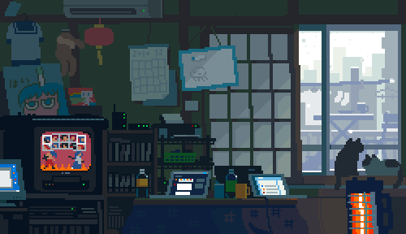

  

<h1 align="center">Vivek Sahu</h1>

  AI Developer at Trivana Capital • AI Lead at GDG SSIPMT

  <a href="https://github.com/vivekvx">GitHub</a> •
  <a href="https://viveksahu.vercel.app/">Portfolio</a> •
  <a href="https://x.com/Vivekvkvq">X / Twitter</a>

## About Me

I build AI-first products, developer tools, and full-stack web experiences with a strong focus on practical systems, clean execution, and polished user experience.

<ul>
  <li><strong>Working on</strong> applied AI products and intelligent developer workflows</li>
  <li><strong>Interested in</strong> agents, MCP tooling, automation, and secure AI systems</li>
  <li><strong>Comfortable across</strong> product thinking, backend systems, and frontend delivery</li>
  <li><strong>Focused on</strong> making software feel faster, smarter, and more useful</li>
</ul>

## Tech Stack

  
  
  
  

  
  
  
  
  

## Current Direction

<ul>
  <li>Building AI products that solve real workflow problems</li>
  <li>Designing systems where intelligence, security, and usability work together</li>
  <li>Shipping projects that blend research ideas with production-minded execution</li>
</ul>

## Connect

<ul>
  <li><strong>Portfolio:</strong> <a href="https://viveksahu.vercel.app/">viveksahu.vercel.app</a></li>
  <li><strong>GitHub:</strong> <a href="https://github.com/vivekvx">github.com/vivekvx</a></li>
  <li><strong>X / Twitter:</strong> <a href="https://x.com/Vivekvkvq">@Vivekvkvq</a></li>
</ul>

---

  <i>Building useful AI, thoughtful products, and developer experiences that feel sharp.</i>

